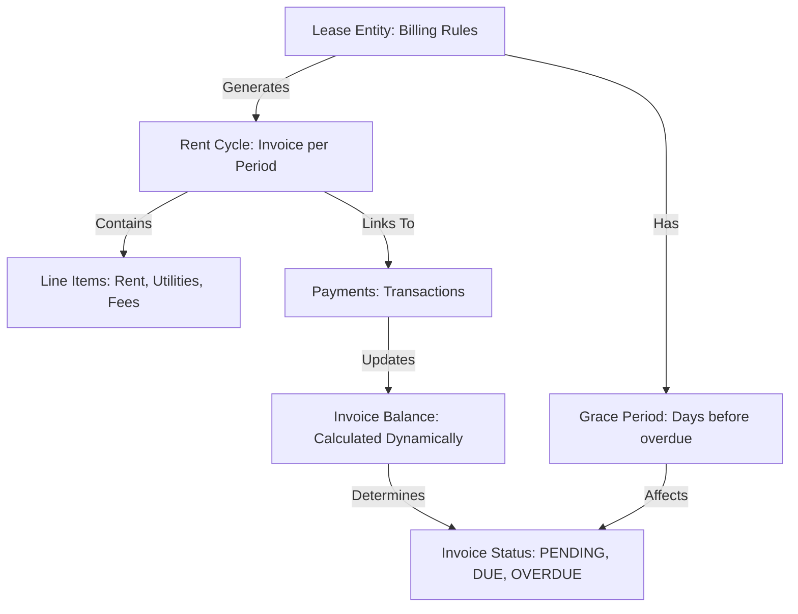
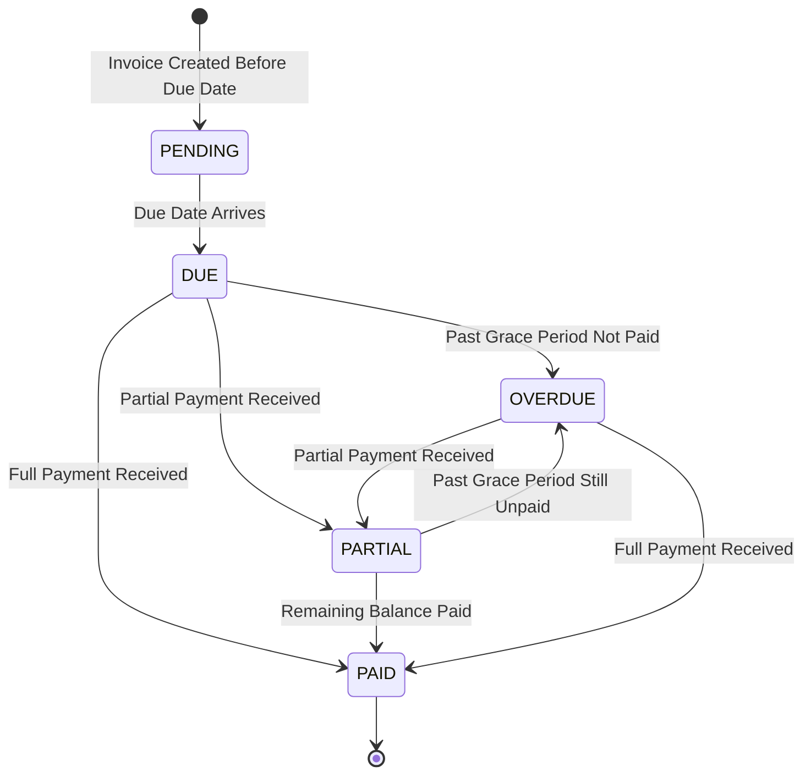

# Rent Cycle (Invoice) Architecture - Frontend Integration Guide

## Overview

This document provides a complete guide for frontend developers implementing the new Rent Cycle (Invoice) system. The Rent Cycle serves as the core link between leases and payments, providing a clear invoice-based billing model.

## Architecture Overview

```javascript
Lease (defines billing rules) → Rent Cycle (Invoice per period) → Payment (transactions)
```

### Data Flow Diagram



### Status Flow Diagram



### Key Concepts

- **Rent Cycle (Invoice)**: A billing period invoice that tracks what's due, what's paid, and the balance
- **Line Items**: Individual charges within an invoice (rent, utilities, pet rent, late fees)
- **Status Calculation**: Status is calculated dynamically based on due date, payments, and grace period
- **Payment Linking**: Payments are linked to Rent Cycles, allowing multiple partial payments per invoice
- **Automatic Generation**: Rent cycles are automatically generated when a lease is activated and on a monthly basis
- **Invoice Number**: Unique identifier for each invoice (format: `INV-YYYY-MM-{sequence}`)

## Authentication & Authorization

All endpoints require authentication via cookie-based session (`access_token` cookie).

**Role Requirements:**

- **Public endpoints**: None (all require authentication)
- **Read operations** (GET): All authenticated users (filtered by company access)
- **Write operations** (POST): `COMPANY_ADMIN` or `MANAGER` roles only
  - `POST /api/v1/rent-cycles` - Create rent cycle
  - `POST /api/v1/rent-cycles/:id/apply-late-fee` - Apply late fee

**Company Access Control:**

- **Tenants**: Can only see their own invoices (filtered by `tenantId = requesterUserId`)
- **Admins/Managers/Staff**: Can see all invoices for companies they belong to (filtered by `companyId IN (:...companyIds)`)
- **Super Admins**: Can see all invoices across all companies (no filtering)
- Access is automatically enforced server-side based on user role

## API Endpoints

### Rent Cycle Endpoints

#### 1. List Rent Cycles (Invoices)

```javascript
GET /api/v1/rent-cycles
```

**Access Control:**
- **Tenants**: Automatically filtered to show only their own invoices (no need to pass `tenantId`)
- **Admins/Managers/Staff**: Automatically filtered to show invoices for companies they belong to
- **Super Admins**: See all invoices across all companies

**Query Parameters:**

- `page` (number, default: 1, min: 1) - Page number (1-based)
- `limit` (number, default: 10, min: 1, max: 100) - Items per page
- `leaseId` (UUID, optional) - Filter by lease ID
- `tenantId` (UUID, optional) - Filter by tenant ID (only works for admins/managers - tenants are automatically filtered to their own invoices)
- `companyId` (UUID, optional) - Filter by company ID (must be a company the user belongs to)
- `statuses` (string, optional) - Comma-separated statuses: "PENDING,DUE,OVERDUE"
- `dueDateFrom` (date string, optional, format: "YYYY-MM-DD") - Filter invoices with due date from this date (inclusive)
- `dueDateTo` (date string, optional, format: "YYYY-MM-DD") - Filter invoices with due date until this date (inclusive)
- `upcoming` (boolean, optional) - Get upcoming invoices (due today or future, not fully paid)
- `sortBy` (string, default: "dueDate") - Sort field
- `sortOrder` ("ASC" | "DESC", default: "ASC") - Sort order

**Response:**

```typescript
{
  success: true,
  data: RentCycleResponseDto[],
  pagination: {
    total: number,
    page: number,
    limit: number,
    totalPages: number
  }
}
```

**Error Responses:**

```typescript
// 401 Unauthorized
{
  success: false,
  message: "Unauthorized",
  statusCode: 401
}

// 400 Bad Request (validation error)
{
  success: false,
  message: "Validation failed",
  statusCode: 400,
  errors: [
    {
      field: "page",
      message: "Page must be an integer"
    }
  ]
}
```

#### 2. Get Upcoming Invoices

```javascript
GET /api/v1/rent-cycles/upcoming
```

**Use Case**: Display invoices that are due today or in the future and not fully paid.

#### 3. Get Overdue Invoices

```javascript
GET /api/v1/rent-cycles/overdue
```

**Use Case**: Display all overdue invoices for quick action.

#### 4. Get Rent Cycles by Lease

```javascript
GET /api/v1/rent-cycles/lease/:leaseId
```

**Use Case**: Show all invoices for a specific lease (invoice history).

**Access Control:**
- **Tenants**: Can only access invoices for leases where they are the tenant
- **Admins/Managers/Staff**: Can access invoices for leases in companies they belong to
- Returns 403 Forbidden if user doesn't have access

#### 5. Get Single Rent Cycle

```javascript
GET /api/v1/rent-cycles/:id
```

**Use Case**: Invoice detail view.

**Access Control:**
- **Tenants**: Can only access invoices where `tenantId` matches their user ID
- **Admins/Managers/Staff**: Can access invoices for companies they belong to
- Returns 403 Forbidden if user doesn't have access

#### 6. Create Rent Cycle (Manual)

```javascript
POST /api/v1/rent-cycles
```

**Required Role**: `COMPANY_ADMIN` or `MANAGER`

**Use Case**: Manually create an invoice (rare, usually automatic).

**Request Body:**

```typescript
{
  leaseId: string;           // UUID of the lease
  period: string;             // Format: "YYYY-MM" (e.g., "2026-01")
  dueDate: string;            // Format: "YYYY-MM-DD" (e.g., "2026-01-05")
  lineItems: [
    {
      type: RentCycleLineItemType;  // RENT, UTILITY, PET_RENT, MAINTENANCE, LATE_FEE
      amount: number;               // Must be >= 0, max 2 decimal places
      description?: string;         // Optional description
    }
  ]
}
```

**Response:**

```typescript
{
  success: true,
  data: RentCycleResponseDto,
  message: "Rent cycle created successfully"
}
```

**Error Responses:**

```typescript
// 400 - Rent cycle already exists for this lease and period
{
  success: false,
  message: "Rent cycle already exists for this lease and period",
  statusCode: 400,
  context: {
    leaseId: "...",
    period: "2026-01"
  }
}

// 404 - Lease not found
{
  success: false,
  message: "Lease not found",
  statusCode: 404
}
```

#### 7. Apply Late Fee

```javascript
POST /api/v1/rent-cycles/:id/apply-late-fee
```

**Required Role**: `COMPANY_ADMIN` or `MANAGER`

**Use Case**: Manually apply late fee to an overdue invoice.

**Note**: Late fees are typically applied automatically by the system when an invoice becomes overdue (past grace period). This endpoint allows manual application if needed.

**Response:**

```typescript
{
  success: true,
  data: RentCycleResponseDto,  // Updated rent cycle with late fee line item
  message: "Late fee applied successfully"
}
```

**Error Responses:**

```typescript
// 400 - Late fee already applied
{
  success: false,
  message: "Late fee already applied to this rent cycle",
  statusCode: 400
}

// 400 - Invoice not overdue
{
  success: false,
  message: "Cannot apply late fee to non-overdue invoice",
  statusCode: 400
}

// 404 - Rent cycle not found
{
  success: false,
  message: "Rent cycle not found",
  statusCode: 404
}
```

### Payment Endpoints (Updated)

#### Create Payment

```javascript
POST /api/v1/payments
```

**New Field**: `rentCycleId` (optional, UUID) - Link payment to specific invoice

**Payment Auto-Linking Logic:**

If `rentCycleId` is not provided but `period` and `leaseId` are provided, the system will automatically:

1. Search for an existing Rent Cycle with matching `leaseId` and `period`
2. If found, automatically link the payment to that Rent Cycle
3. If not found, payment is created without a Rent Cycle link (legacy behavior)

**Recommended Approach:**

- Always provide `rentCycleId` when creating payments for invoices
- This ensures accurate invoice balance calculations
- Pre-fill `rentCycleId` from the invoice detail page when recording payment

**Request Body Example:**

```typescript
{
  leaseId: string,
  rentCycleId?: string,      // NEW: Link to invoice (recommended)
  amount: number,
  amountDue?: number,        // Optional: total amount due for period
  paymentDate: string,       // Format: "YYYY-MM-DD"
  paymentMethod: PaymentMethod,  // CASH, BANK_TRANSFER, MOBILE_MONEY, etc.
  paymentType: PaymentType,  // RENT, DEPOSIT, LATE_FEE, etc.
  period?: string,           // Format: "YYYY-MM" (used for auto-linking if rentCycleId not provided)
  reference?: string,        // Payment reference number
  notes?: string,
  currency?: string          // Defaults to lease currency
}
```

#### List Payments (Updated)

```javascript
GET /api/v1/payments
```

**New Query Parameter**: `rentCycleId` (optional, UUID) - Filter payments by invoice

**Use Case**: Show all payments for a specific invoice on the invoice detail page.

**Example:**

```typescript
GET /api/v1/payments?rentCycleId=123e4567-e89b-12d3-a456-426614174000
```

## Response Structures

### RentCycleResponseDto

```typescript
{
  id: string;
  leaseId: string;
  leaseNumber?: string;
  companyId: string;
  tenantId: string;
  tenantName?: string;
  invoiceNumber: string;        // Format: "INV-YYYY-MM-{sequence}" (e.g., "INV-2026-01-001")
  period: string;               // Format: "YYYY-MM"
  dueDate: Date;                 // When payment is due
  totalAmountDue: number;        // Total amount for this invoice
  amountPaid: number;            // Calculated from linked payments
  balance: number;                // totalAmountDue - amountPaid
  status: RentCycleStatus;       // PENDING, DUE, OVERDUE, PARTIAL, PAID, CANCELLED
  lineItems: RentCycleLineItem[];
  paymentsCount?: number;
  createdAt: Date;
  updatedAt: Date;
}
```

### RentCycleLineItem

```typescript
{
  id: string;
  type: RentCycleLineItemType;   // RENT, UTILITY, PET_RENT, MAINTENANCE, LATE_FEE
  amount: number;
  description?: string;
  isLateFee: boolean;
}
```

### RentCycleStatus Enum

```typescript
enum RentCycleStatus {
  PENDING = 'PENDING',    // Before due date
  DUE = 'DUE',            // On due date or within grace period
  OVERDUE = 'OVERDUE',    // Past grace period, not paid
  PARTIAL = 'PARTIAL',    // Partially paid
  PAID = 'PAID',          // Fully paid
  CANCELLED = 'CANCELLED' // Cancelled invoice
}
```

## Status Calculation Logic

Status is calculated dynamically based on:

1. **Balance**: `totalAmountDue - amountPaid`
2. **Due Date**: When payment is due
3. **Grace Period**: Days after due date before invoice is considered overdue (from lease `gracePeriodDays`)
4. **Current Date**: Today's date

**Status Priority (in order):**

1. If `balance <= 0` → `PAID` (fully paid, regardless of date)
2. If `amountPaid > 0` and `balance > 0` → `PARTIAL` (partially paid)
3. If `today < dueDate` → `PENDING` (not yet due)
4. If `today === dueDate` → `DUE` (due today)
5. If `today > dueDate + gracePeriodDays` → `OVERDUE` (past grace period)
6. Otherwise → `DUE` (within grace period, not yet overdue)

**Grace Period Example:**

- Due Date: January 5, 2026
- Grace Period: 5 days (from lease)
- Grace Period End: January 10, 2026
- Status on Jan 5-10: `DUE` (within grace period)
- Status on Jan 11+: `OVERDUE` (past grace period)

**Important Notes:**

- Status is calculated server-side on every request (not stored in database)
- Grace period comes from the associated lease (`lease.gracePeriodDays`)
- Status may change automatically as days pass (e.g., `PENDING` → `DUE` → `OVERDUE`)

## UI/UX Recommendations

### 1. Lease List Page

**Display:**

- Lease card should show:
- Current invoice status badge (if active lease)
- Next due date
- Outstanding balance (sum of unpaid invoices)
- Quick action: "View Invoices" button

**Status Badge Colors:**

- `PENDING`: Blue/Gray
- `DUE`: Yellow/Orange (urgent)
- `OVERDUE`: Red (critical)
- `PARTIAL`: Orange
- `PAID`: Green

**Example Card:**

```javascript
┌─────────────────────────────────────┐
│ Lease #LEASE-2026-001               │
│ Tenant: John Doe                    │
│ Unit: A2                            │
│                                     │
│ Status: [ACTIVE]                    │
│ Current Invoice: [DUE]              │
│ Next Due: Jan 5, 2026              │
│ Outstanding: KES 40,000            │
│                                     │
│ [View Invoices] [Record Payment]   │
└─────────────────────────────────────┘
```

### 2. Lease Detail Page

**New Section: "Invoices" Tab**

Display all Rent Cycles for this lease:

- Invoice number
- Period (e.g., "January 2026")
- Due date
- Status badge
- Amount due / Amount paid / Balance
- Actions: "View Details", "Record Payment"

**Quick Stats:**

- Total outstanding
- Next due date
- Overdue count

### 3. Invoices Page (New)

**Recommended Location**: Main navigation or under "Payments" section

**Views:**

1. **All Invoices** - List with filters
2. **Upcoming** - Invoices due soon (default view for tenants)
3. **Overdue** - Critical invoices requiring attention
4. **By Lease** - Filtered by lease

**Invoice Card:**

```javascript
┌─────────────────────────────────────┐
│ INV-2026-01-001                     │
│ Lease: LEASE-2026-001               │
│ Period: January 2026                │
│ Due Date: Jan 5, 2026               │
│                                     │
│ Status: [DUE]                       │
│                                     │
│ Amount Due: KES 40,000             │
│ Amount Paid: KES 0                 │
│ Balance: KES 40,000                │
│                                     │
│ [View Details] [Record Payment]    │
└─────────────────────────────────────┘
```

### 4. Invoice Detail Page (New)

**Display:**

- Invoice header (number, period, due date, status)
- Line items breakdown
- Payment history (linked payments)
- Balance summary
- Action buttons based on status

**Action Buttons by Status:**

- `PENDING`: "Record Payment" (pre-fill amount = balance)
- `DUE`: "Pay Now" (prominent, urgent styling)
- `OVERDUE`: "Pay Now" (red, critical) + "Apply Late Fee" (admin)
- `PARTIAL`: "Pay Remaining" (amount = balance)
- `PAID`: "View Receipt" / "Download Invoice"

**Line Items Display:**

```javascript
Line Items:
├─ Rent                    KES 40,000
├─ Utilities               KES 2,000
├─ Pet Rent                KES 1,000
└─ Late Fee                KES 50
────────────────────────────────────
Total Amount Due:          KES 43,050
Amount Paid:               KES 20,000
────────────────────────────────────
Balance:                   KES 23,050
```

### 5. Payment Page (Enhanced)

**Current**: Shows payment history

**Enhancement**: Add "Invoices" view or tab

**New Features:**

- Filter payments by `rentCycleId`
- Show which invoice each payment belongs to
- Group payments by invoice
- Quick action: "View Invoice" from payment row

### 6. Dashboard / Home Page

**Widgets to Add:**

1. **Upcoming Invoices** (Tenant View)

- Show next 3-5 invoices due soon
- Quick "Pay Now" action

2. **Overdue Invoices** (Admin/Manager View)

- Count of overdue invoices
- Total overdue amount
- Quick link to overdue list

3. **Payment Summary**

- Total collected this month
- Pending collections
- Overdue amount

## Action Flows

### Flow 1: Paying a Due Invoice

**Scenario**: Tenant sees invoice with status "DUE"

**Steps:**

1. User clicks on invoice card (from Lease Detail or Invoices page)
2. Navigate to Invoice Detail page
3. Click "Pay Now" button
4. Payment form opens with:

- Pre-filled `rentCycleId`
- Pre-filled `amount` = `balance`
- Pre-filled `leaseId`
- Pre-filled `period`

5. User selects payment method, enters reference, etc.
6. Submit payment
7. Invoice status updates to `PAID` or `PARTIAL`

**API Call:**

```typescript
POST /api/v1/payments
{
  leaseId: "...",
  rentCycleId: "...",  // From invoice
  amount: 40000,       // balance from invoice
  paymentDate: "2026-01-05",
  paymentMethod: "CASH",
  paymentType: "RENT",
  period: "2026-01"    // From invoice
}
```

### Flow 2: Viewing Invoice History

**Scenario**: User wants to see all invoices for a lease

**Steps:**

1. From Lease Detail page, click "Invoices" tab
2. Or navigate to Invoices page and filter by `leaseId`
3. Display list of all Rent Cycles for that lease
4. Each row shows: Invoice #, Period, Due Date, Status, Balance
5. Click row to view details

**API Call:**

```typescript
GET /api/v1/rent-cycles/lease/:leaseId
```

### Flow 3: Recording Partial Payment

**Scenario**: Tenant pays part of invoice amount

**Steps:**

1. Navigate to Invoice Detail page
2. Click "Record Payment" or "Pay Partial"
3. Payment form opens
4. User enters partial amount (less than balance)
5. Submit payment
6. Invoice status updates to `PARTIAL`
7. Balance reduces by payment amount

**API Call:**

```typescript
POST /api/v1/payments
{
  leaseId: "...",
  rentCycleId: "...",
  amount: 20000,  // Partial amount
  // ... other fields
}
```

### Flow 4: Viewing Upcoming Invoices (Tenant)

**Scenario**: Tenant wants to see what's due soon

**Steps:**

1. Navigate to "Invoices" page
2. Default view shows "Upcoming" tab
3. Display invoices with `dueDate >= today` and `status !== PAID`
4. Sort by `dueDate ASC`
5. Show countdown: "Due in 3 days"

**API Call:**

```typescript
GET /api/v1/rent-cycles/upcoming
```

### Flow 5: Admin Viewing Overdue Invoices

**Scenario**: Admin needs to see all overdue invoices

**Steps:**

1. Navigate to "Invoices" page
2. Click "Overdue" tab
3. Display all invoices with `status = OVERDUE`
4. Show total overdue amount
5. Bulk actions: "Send Reminders", "Apply Late Fees"

**API Call:**

```typescript
GET /api/v1/rent-cycles/overdue
```

## Status Display Guidelines

### Where to Show Status

1. **Lease List**: Current invoice status (if active lease)
2. **Lease Detail**: All invoice statuses in "Invoices" tab
3. **Invoices Page**: Status badge on each invoice card
4. **Invoice Detail**: Prominent status badge at top
5. **Dashboard**: Status summary widgets
6. **Payment History**: Link to invoice and show invoice status

### Status Badge Styling

```typescript
const statusStyles = {
  PENDING: {
    color: '#6B7280',      // Gray
    bg: '#F3F4F6',
    label: 'Pending'
  },
  DUE: {
    color: '#F59E0B',      // Amber
    bg: '#FEF3C7',
    label: 'Due Today',
    urgent: true
  },
  OVERDUE: {
    color: '#DC2626',      // Red
    bg: '#FEE2E2',
    label: 'Overdue',
    critical: true
  },
  PARTIAL: {
    color: '#EA580C',      // Orange
    bg: '#FFEDD5',
    label: 'Partially Paid'
  },
  PAID: {
    color: '#059669',      // Green
    bg: '#D1FAE5',
    label: 'Paid'
  },
  CANCELLED: {
    color: '#6B7280',      // Gray
    bg: '#F3F4F6',
    label: 'Cancelled'
  }
}
```

## Implementation Checklist

### Phase 1: Basic Display

- [ ] Add "Invoices" page/route
- [ ] Create invoice list component
- [ ] Create invoice detail component
- [ ] Add invoice status badges
- [ ] Display line items breakdown

### Phase 2: Integration

- [ ] Add "Invoices" tab to Lease Detail page
- [ ] Add invoice status to Lease List cards
- [ ] Link payments to invoices in Payment History
- [ ] Add invoice filter to Payment page

### Phase 3: Actions

- [ ] "Pay Now" button on invoice cards
- [ ] Payment form with pre-filled invoice data
- [ ] "View Invoice" link from payment rows
- [ ] "Record Payment" from invoice detail

### Phase 4: Dashboard

- [ ] Upcoming invoices widget
- [ ] Overdue invoices widget
- [ ] Payment summary widgets

### Phase 5: Advanced

- [ ] Invoice search and filters
- [ ] Bulk actions for admins (apply late fees, send reminders)
- [ ] Invoice export/PDF generation
- [ ] Payment reminders (email/SMS)
- [ ] Invoice templates customization
- [ ] Recurring invoice automation settings

## Example API Integration

### Fetching Upcoming Invoices

```typescript
// React/TypeScript example
const fetchUpcomingInvoices = async () => {
  const response = await fetch('/api/v1/rent-cycles/upcoming', {
    headers: {
      'Cookie': `access_token=${token}`
    }
  });
  const data = await response.json();
  return data.data; // RentCycleResponseDto[]
};

// Usage
const invoices = await fetchUpcomingInvoices();
invoices.forEach(invoice => {
  console.log(`${invoice.invoiceNumber}: ${invoice.status}`);
  console.log(`Due: ${invoice.dueDate}, Balance: ${invoice.balance}`);
});
```

### Creating Payment for Invoice

```typescript
const payInvoice = async (invoice: RentCycleResponseDto, paymentData: {
  amount: number;
  paymentMethod: string;
  paymentDate: string;
  reference?: string;
}) => {
  const response = await fetch('/api/v1/payments', {
    method: 'POST',
    headers: {
      'Content-Type': 'application/json',
      'Cookie': `access_token=${token}`
    },
    body: JSON.stringify({
      leaseId: invoice.leaseId,
      rentCycleId: invoice.id,  // Link to invoice (required for proper balance calculation)
      amount: paymentData.amount,
      amountDue: invoice.totalAmountDue,
      paymentDate: paymentData.paymentDate,
      paymentMethod: paymentData.paymentMethod,
      paymentType: 'RENT',
      period: invoice.period,
      reference: paymentData.reference
    })
  });
  
  if (!response.ok) {
    const error = await response.json();
    throw new Error(error.message || 'Payment creation failed');
  }
  
  return response.json();
};
```

### Fetching Payments for an Invoice

```typescript
const getInvoicePayments = async (rentCycleId: string) => {
  const response = await fetch(
    `/api/v1/payments?rentCycleId=${rentCycleId}`,
    {
      headers: {
        'Cookie': `access_token=${token}`
      }
    }
  );
  
  if (!response.ok) {
    throw new Error('Failed to fetch payments');
  }
  
  const data = await response.json();
  return data.data; // PaymentResponseDto[]
};
```

### Error Handling Example

```typescript
try {
  const invoice = await fetchInvoice(invoiceId);
  await payInvoice(invoice, paymentData);
  
  // Refresh invoice to get updated balance and status
  const updatedInvoice = await fetchInvoice(invoiceId);
  console.log(`New balance: ${updatedInvoice.balance}`);
  console.log(`New status: ${updatedInvoice.status}`);
} catch (error) {
  if (error.response?.status === 400) {
    // Validation error
    console.error('Validation failed:', error.response.data.errors);
  } else if (error.response?.status === 401) {
    // Unauthorized - redirect to login
    window.location.href = '/login';
  } else if (error.response?.status === 403) {
    // Forbidden - insufficient permissions
    alert('You do not have permission to perform this action');
  } else {
    // Other errors
    console.error('Payment failed:', error.message);
  }
}
```

## Automatic Rent Cycle Generation

Rent cycles are automatically generated by the system:

### When Lease is Activated

1. **First Rent Cycle**: Created immediately when a lease status changes to `ACTIVE`

   - Period: Based on `billingStartDate` (or `startDate` if not provided)
   - Due Date: Calculated from `rentDueDay` and `billingStartDate`
   - Line Items: Calculated from lease configuration (rent, utilities, pet rent, etc.)
   - Invoice Number: Auto-generated

2. **Subsequent Rent Cycles**: Generated monthly by scheduled job

   - Period: Next month after previous cycle
   - Due Date: Based on `rentDueDay` of the lease
   - Line Items: Recalculated from current lease configuration

### Generation Rules

- **Uniqueness**: Only one rent cycle per lease per period (enforced by database constraint)
- **Proration**: First month can be prorated if `proratedFirstMonth: true` on lease
- **Line Items**: Automatically calculated from:
  - `monthlyRent` → RENT line item
  - `utilityCosts` → UTILITY line item (if not included in rent)
  - `petRent` → PET_RENT line item (if applicable)

### Manual Creation

Rent cycles can be manually created via `POST /api/v1/rent-cycles` (admin/manager only), but this is typically only needed for:

- Adjustments or corrections
- Special billing scenarios
- Testing purposes

## Migration Notes

### Backward Compatibility

- Existing Payment endpoints continue to work
- Old payments are marked with `isLegacy: true` in the database
- New payments automatically link to Rent Cycles when `rentCycleId` or `period` is provided
- You can gradually migrate UI to use Rent Cycle endpoints
- Legacy payments (without `rentCycleId`) do not affect invoice balances

### Recommended Migration Path

1. **Phase 1**: Add Rent Cycle endpoints alongside existing Payment endpoints
2. **Phase 2**: Update Lease Detail page to show Rent Cycles
3. **Phase 3**: Add new Invoices page
4. **Phase 4**: Update Payment page to show invoice links
5. **Phase 5**: Deprecate old payment-based invoice views (if any)

## Late Fee Calculation

Late fees are calculated based on the lease configuration:

### Late Fee Types

1. **FIXED**: Fixed amount added to invoice

   - Example: `lateFeeValue: 50.00` → Adds KES 50.00 to invoice balance
   - Applied as a new line item with `type: LATE_FEE` and `isLateFee: true`

2. **PERCENTAGE**: Percentage of total amount due

   - Example: `lateFeeValue: 5` → Adds 5% of `totalAmountDue` to invoice balance
   - Calculation: `lateFeeAmount = totalAmountDue * (lateFeeValue / 100)`

3. **NONE**: No late fee applied

   - Invoice can still become `OVERDUE` but no fee is added

### Late Fee Application

- **Automatic**: Applied by scheduled job when invoice becomes overdue (past grace period)
- **Manual**: Can be applied via `POST /api/v1/rent-cycles/:id/apply-late-fee` (admin/manager only)
- **One-time**: Late fee is applied only once per invoice (checked via `isLateFee` flag on line items)
- **Line Item**: Late fee appears as a separate line item in the invoice

### Example

```typescript
// Invoice before late fee
{
  totalAmountDue: 40000,
  lineItems: [
    { type: "RENT", amount: 40000, isLateFee: false }
  ]
}

// Invoice after late fee (FIXED, 50.00)
{
  totalAmountDue: 40050,  // Updated
  lineItems: [
    { type: "RENT", amount: 40000, isLateFee: false },
    { type: "LATE_FEE", amount: 50, isLateFee: true }  // Added
  ]
}
```

## Invoice Number Format

Invoice numbers are auto-generated with the format: `INV-YYYY-MM-{sequence}`

- **Prefix**: `INV-`
- **Year-Month**: Period in `YYYY-MM` format
- **Sequence**: 3-digit sequence number (001, 002, 003, etc.) per company per period

**Examples:**

- `INV-2026-01-001` - First invoice for January 2026
- `INV-2026-01-002` - Second invoice for January 2026
- `INV-2026-02-001` - First invoice for February 2026

**Uniqueness**: Invoice numbers are unique across the entire system (enforced by database constraint).

## Troubleshooting

### Common Issues

1. **Status not updating**: Status is calculated dynamically - refresh the invoice or make a new API call
2. **Payment not linking**: Ensure `rentCycleId` is included in payment creation, or provide `period` + `leaseId` for auto-linking
3. **Duplicate invoices**: System prevents duplicates (same lease + period) - you'll get a 400 error if attempting to create a duplicate
4. **Late fee not applied**: Check if invoice is actually overdue (past grace period) and if late fee type is not `NONE`
5. **Balance incorrect**: Ensure all payments are linked to the rent cycle via `rentCycleId` - legacy payments without `rentCycleId` won't affect invoice balance
6. **Access denied**: Verify user has proper company access and role permissions
7. **Invoice not found**: Check if invoice belongs to a company the user has access to

