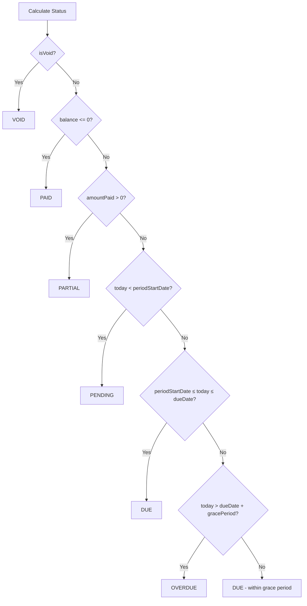

# Rent Cycle & Invoice System - Complete Frontend Guide

## Overview

This guide provides comprehensive documentation for the rent cycle and invoice system, including all explicit rules, status transitions, and edge cases. This document is the authoritative reference for frontend developers implementing invoice and payment features.

## Table of Contents

1. [Core Concepts](#core-concepts)
2. [Invoice Status System](#invoice-status-system)
3. [Period Boundaries](#period-boundaries)
4. [Payment Rules](#payment-rules)
5. [Deposit Handling](#deposit-handling)
6. [Grace Period Rules](#grace-period-rules)
7. [Credit Lifecycle](#credit-lifecycle)
8. [Tenant Truth Source](#tenant-truth-source)
9. [Edge Cases & Scenarios](#edge-cases--scenarios)
10. [API Reference](#api-reference)
11. [Best Practices](#best-practices)

---

## Core Concepts

### Invoice = Obligation

**Key Principle**: An invoice represents a rent obligation, not a payment request.

- Invoices are generated when rent becomes owed (at period start)
- Invoices exist independently of payments
- Payments settle invoices, but invoices are not created by payments

### Due Date = Deadline

**Key Principle**: Due date represents when payment is expected, not when invoice is created.

- Invoice is created at period start
- Due date is when payment should be received
- Status transitions based on period boundaries and due date

### Payment = Settlement

**Key Principle**: Payments settle existing invoices, they don't create them.

- Payments link to specific invoices via `rentCycleId`
- Payments can be partial, full, or overpayments
- Payments never auto-generate invoices

### Lease Activation ≠ Payment

**Key Principle**: Lease becomes active when obligation exists, not when payment is received.

- Lease activates when `startDate <= today`
- First invoice is generated on activation
- Payment is not required for activation

---

## Invoice Status System

### Status Enum

```typescript
enum RentCycleStatus {
  PENDING = 'PENDING',    // Period not started yet
  DUE = 'DUE',            // Period started, payment due
  OVERDUE = 'OVERDUE',    // Past grace period, unpaid
  PARTIAL = 'PARTIAL',    // Partially paid
  PAID = 'PAID',          // Fully paid
  CANCELLED = 'CANCELLED', // Cancelled (legacy)
  VOID = 'VOID'           // Voided (cancelled/admin action)
}
```

### Explicit Status Transition Rules

Status is calculated using these explicit rules (in priority order):

1. **VOID**: `isVoid === true` (takes precedence over all)
2. **PAID**: `balance <= 0` (fully paid, regardless of date)
3. **PARTIAL**: `amountPaid > 0 && balance > 0` (partially paid)
4. **PENDING**: `today < periodStartDate` (period not started)
5. **DUE**: `periodStartDate ≤ today ≤ dueDate` (period started, payment due)
6. **OVERDUE**: `today > dueDate + gracePeriodDays` (past grace period, unpaid)

### Status Calculation Flow



### Status Examples

**Example 1: Invoice Created Today, Due in 7 Days**
- `periodStartDate`: 2024-01-01
- `dueDate`: 2024-01-08
- `today`: 2024-01-01
- **Status**: `DUE` (period started, payment due)

**Example 2: Invoice Created, Period Not Started**
- `periodStartDate`: 2024-01-15
- `dueDate`: 2024-01-22
- `today`: 2024-01-10
- **Status**: `PENDING` (period not started yet)

**Example 3: Past Due Date, Within Grace Period**
- `periodStartDate`: 2024-01-01
- `dueDate`: 2024-01-08
- `gracePeriodDays`: 5
- `today`: 2024-01-10 (2 days past due, 3 days before grace period ends)
- **Status**: `DUE` (within grace period)

**Example 4: Past Grace Period**
- `periodStartDate`: 2024-01-01
- `dueDate`: 2024-01-08
- `gracePeriodDays`: 5
- `today`: 2024-01-15 (7 days past due, 2 days past grace period)
- **Status**: `OVERDUE`

---

## Period Boundaries

### What Are Period Boundaries?

Every invoice has explicit period boundaries that define when the rent obligation exists:

- **`periodStartDate`**: When the invoice period begins (rent obligation starts)
- **`periodEndDate`**: When the invoice period ends (rent obligation ends)
- **`dueDate`**: When payment is expected (deadline)

### Why Period Boundaries Matter

Period boundaries enable:

1. **Clear Status Calculation**: Status depends on whether period has started
2. **Advance Payment Support**: Future invoices can exist and accept payments
3. **Proration Logic**: Partial periods are clearly defined
4. **Cutoff Rules**: No invoices generated after lease end

### Period Boundary Examples

**Monthly Invoice (Full Period)**
```json
{
  "periodStartDate": "2024-01-01",
  "periodEndDate": "2024-01-31",
  "dueDate": "2024-01-05",
  "period": "2024-01"
}
```

**Partial Period (Lease Ends Mid-Month)**
```json
{
  "periodStartDate": "2024-01-01",
  "periodEndDate": "2024-01-15",  // Lease ends on 15th
  "dueDate": "2024-01-05",
  "period": "2024-01"
}
```

### Using Period Boundaries in Frontend

```typescript
// Check if invoice period has started
const isPeriodStarted = new Date(invoice.periodStartDate) <= new Date();

// Check if invoice is for future period
const isFutureInvoice = new Date(invoice.periodStartDate) > new Date();

// Display period information
const periodInfo = `Period: ${formatDate(invoice.periodStartDate)} - ${formatDate(invoice.periodEndDate)}`;
```

---

## Payment Rules

### Payment Application Rules

1. **Payments Apply to Specific Invoices**
   - Always provide `rentCycleId` when creating payments
   - Payments link to invoices, not periods

2. **Support for Partial Payments**
   - Multiple payments can be applied to one invoice
   - Invoice status becomes `PARTIAL` when partially paid

3. **Support for Overpayments (Credit)**
   - Payments can exceed invoice amount
   - Excess creates negative balance (credit)
   - Credit is stored but never auto-applied

4. **Support for Advance Payments**
   - Payments can link to future invoices (via `rentCycleId`)
   - Future invoices can accept payments before period starts
   - Advance payments create credit on future invoices

### Payment Creation

**Recommended Approach** (Always provide `rentCycleId`):

```typescript
const createPayment = async (invoiceId: string, amount: number) => {
  const response = await fetch('/api/v1/payments', {
    method: 'POST',
    headers: { 'Content-Type': 'application/json' },
    body: JSON.stringify({
      leaseId: invoice.leaseId,
      rentCycleId: invoiceId,  // ← Always provide this
      amount: amount,
      paymentDate: new Date().toISOString().split('T')[0],
      paymentMethod: 'BANK_TRANSFER',
      paymentType: 'RENT',
      currency: 'KES'
    })
  });
  return response.json();
};
```

**Payment Validation Rules**:

- Payment amount can exceed invoice balance (overpayment allowed)
- Negative balance (credit) is stored but not auto-applied
- Deposit payments cannot be applied to rent invoices
- Rent payments cannot be applied to deposit invoices

### Overpayment Handling

```typescript
// Example: Tenant pays $2000 for $1500 invoice
const invoice = {
  totalAmountDue: 1500,
  amountPaid: 0,
  balance: 1500
};

// After payment of $2000
const updatedInvoice = {
  totalAmountDue: 1500,
  amountPaid: 2000,
  balance: -500,  // Negative balance = credit
  status: 'PAID'  // Status is PAID (balance <= 0)
};

// Credit is stored but NOT automatically applied to next invoice
// Future implementation: Manual credit application
```

---

## Deposit Handling

### Deposit Rules

**CRITICAL**: Deposits are completely separate from rent invoices.

1. **Deposit Invoices**
   - Created separately when lease is created
   - Marked with `isDeposit: true`
   - Have `DEPOSIT` line item type
   - Invoice number format: `DEP-YYYY-MM-###`

2. **Deposit Payments**
   - Must use `paymentType: 'DEPOSIT'`
   - Can only be applied to deposit invoices
   - Cannot be applied to rent invoices

3. **Deposit Safeguards**
   - Deposit invoices CANNOT affect rent status
   - Deposit payments CANNOT be applied to rent invoices
   - Deposit refunds do NOT create rent credit
   - Deposits are excluded from rent calculations

### Deposit Invoice Structure

```json
{
  "id": "deposit-invoice-uuid",
  "invoiceNumber": "DEP-2024-01-001",
  "period": "DEPOSIT-2024-01",
  "isDeposit": true,
  "lineItems": [
    {
      "type": "DEPOSIT",
      "amount": 1500.00,
      "description": "Security deposit"
    }
  ],
  "totalAmountDue": 1500.00,
  "dueDate": "2024-01-01"
}
```

### Frontend Handling

```typescript
// Filter deposits from rent invoices
const rentInvoices = invoices.filter(inv => !inv.isDeposit);
const depositInvoices = invoices.filter(inv => inv.isDeposit);

// When creating deposit payment
const createDepositPayment = async (depositInvoiceId: string, amount: number) => {
  await fetch('/api/v1/payments', {
    method: 'POST',
    body: JSON.stringify({
      leaseId: leaseId,
      rentCycleId: depositInvoiceId,
      amount: amount,
      paymentType: 'DEPOSIT',  // ← Must be DEPOSIT
      paymentMethod: 'BANK_TRANSFER',
      // ... other fields
    })
  });
};
```

---

## Grace Period Rules

### Authoritative Grace Period Rule

**SINGLE SOURCE OF TRUTH**:

> Grace period ONLY affects OVERDUE transition (not DUE).
> Grace period NEVER affects invoice generation.
> Grace period NEVER affects period boundaries.

### How Grace Period Works

1. **DUE Status**
   - Occurs when: `periodStartDate ≤ today ≤ dueDate`
   - Grace period does NOT affect when DUE occurs
   - DUE happens on or after period start, up to due date

2. **OVERDUE Status**
   - Occurs when: `today > dueDate + gracePeriodDays`
   - Grace period delays the transition from DUE to OVERDUE
   - If `dueDate < today ≤ dueDate + gracePeriodDays`, status is still DUE

### Grace Period Timeline

```
Period Start          Due Date           Grace Period End
     |                    |                      |
     |                    |                      |
     ▼                    ▼                      ▼
[PENDING]          [DUE]              [DUE]            [OVERDUE]
                    (within grace)    (past grace)
```

### Frontend Implementation

```typescript
// Calculate grace period end
const calculateGracePeriodEnd = (dueDate: Date, gracePeriodDays: number): Date => {
  const end = new Date(dueDate);
  end.setDate(end.getDate() + gracePeriodDays);
  return end;
};

// Check if invoice is in grace period
const isInGracePeriod = (invoice: RentCycle): boolean => {
  const today = new Date();
  today.setHours(0, 0, 0, 0);
  const dueDate = new Date(invoice.dueDate);
  dueDate.setHours(0, 0, 0, 0);
  const gracePeriodEnd = calculateGracePeriodEnd(dueDate, invoice.lease.gracePeriodDays);
  
  return today > dueDate && today <= gracePeriodEnd;
};

// Display grace period information
if (invoice.status === 'DUE' && isInGracePeriod(invoice)) {
  const daysRemaining = Math.ceil(
    (gracePeriodEnd.getTime() - today.getTime()) / (1000 * 60 * 60 * 24)
  );
  console.log(`Payment due. ${daysRemaining} days remaining in grace period.`);
}
```

---

## Credit Lifecycle

### Credit Lifecycle Rule (MVP-Safe)

**Explicit Rule**:

> Credit (negative balance) is stored but NEVER auto-applied.
> Credit requires explicit implementation in future.
> Credit can be manually applied to future invoices (future feature).

### Current Behavior

1. **Credit Creation**
   - Overpayments create negative balance
   - Credit is stored in invoice/payment balance
   - Credit is visible but not actionable

2. **Credit Storage**
   - Negative balance = credit amount
   - Credit is associated with specific invoice
   - Credit persists until manually handled

3. **Credit Application**
   - **NOT automatically applied** to next invoice
   - **NOT automatically refunded**
   - Requires manual intervention or future implementation

### Frontend Display

```typescript
// Display credit information
const displayInvoice = (invoice: RentCycle) => {
  if (invoice.balance < 0) {
    const creditAmount = Math.abs(invoice.balance);
    return {
      ...invoice,
      hasCredit: true,
      creditAmount: creditAmount,
      displayMessage: `Credit: ${creditAmount} (not auto-applied)`
    };
  }
  return invoice;
};

// Show credit warning
if (invoice.balance < 0) {
  console.warn(
    `Invoice has credit of ${Math.abs(invoice.balance)}. ` +
    `Credit is stored but not automatically applied to future invoices.`
  );
}
```

### Future Credit Features (Not Implemented)

- Manual credit application to future invoices
- Credit refund functionality
- Credit expiration rules
- Credit transfer between invoices

---

## Tenant Truth Source

### Single Source of Truth Rule

**CRITICAL PRINCIPLE**:

> Invoice status is the SINGLE SOURCE OF TRUTH for tenant payment status.

### What This Means

1. **Tenant Payment Status is Derived**
   - Tenant/lease payment status is calculated from invoice statuses
   - Payment status is NOT stored on tenant or lease entities
   - No caching of payment status

2. **How to Determine Tenant Payment Status**
   - Query all invoices for tenant/lease
   - Calculate status from invoice statuses
   - Check for any OVERDUE invoices

3. **What Tenant Status Represents**
   - `ACTIVE`: Tenant has active leases (lease existence)
   - `FORMER`: Tenant has no active leases
   - **NOT** payment status (due/overdue)

### Frontend Implementation

```typescript
// Get tenant payment status (derived from invoices)
const getTenantPaymentStatus = async (tenantId: string, leaseId: string) => {
  // Fetch all invoices for lease
  const invoices = await fetch(`/api/v1/rent-cycles?leaseId=${leaseId}`)
    .then(res => res.json())
    .then(data => data.data);
  
  // Exclude deposits and voided invoices
  const rentInvoices = invoices.filter(
    inv => !inv.isDeposit && inv.status !== 'VOID'
  );
  
  // Determine payment status
  const hasOverdue = rentInvoices.some(inv => inv.status === 'OVERDUE');
  const hasDue = rentInvoices.some(inv => inv.status === 'DUE');
  const hasPartial = rentInvoices.some(inv => inv.status === 'PARTIAL');
  const allPaid = rentInvoices.every(inv => inv.status === 'PAID');
  
  return {
    hasOverdue,
    hasDue,
    hasPartial,
    allPaid,
    status: hasOverdue ? 'OVERDUE' : hasDue ? 'DUE' : allPaid ? 'PAID' : 'CURRENT'
  };
};

// Display tenant payment status
const displayTenantStatus = async (tenantId: string) => {
  const leases = await getTenantLeases(tenantId);
  
  for (const lease of leases) {
    const paymentStatus = await getTenantPaymentStatus(tenantId, lease.id);
    console.log(`Lease ${lease.leaseNumber}: ${paymentStatus.status}`);
  }
};
```

### Important Notes

- **DO NOT** cache payment status on tenant/lease objects
- **DO NOT** store payment status in local state without refreshing
- **ALWAYS** query invoice statuses for current payment status
- Tenant `status` field (ACTIVE/FORMER) is separate from payment status

---

## Edge Cases & Scenarios

### 1. Backdated Lease Creation

**Scenario**: Lease created today with start date in the past.

**System Behavior**:
- First invoice is generated immediately (for current period)
- If first invoice due date ≤ today, next invoice is also generated immediately
- Tenant can pay both current and next period invoices

**Frontend Handling**:

```typescript
// When creating backdated lease
const createBackdatedLease = async (leaseData: CreateLeaseDto) => {
  const lease = await createLease(leaseData);
  
  // System automatically generates invoices
  // Check for multiple invoices
  const invoices = await getLeaseInvoices(lease.id);
  
  // May have 2 invoices if lease is backdated
  if (invoices.length > 1) {
    console.log('Backdated lease: Multiple invoices generated');
    // Allow tenant to pay both invoices
  }
};
```

### 2. Lease Cancellation Before Start

**Scenario**: Lease cancelled before start date.

**System Behavior**:
- All generated invoices are voided
- Voided invoices cannot accept payments
- Lease status becomes TERMINATED

**Frontend Handling**:

```typescript
// Check for voided invoices
const hasVoidedInvoices = invoices.some(inv => inv.status === 'VOID');

if (hasVoidedInvoices) {
  const voidedInvoices = invoices.filter(inv => inv.status === 'VOID');
  console.log('Lease cancelled: Invoices voided', voidedInvoices);
  // Hide voided invoices from payment UI
}
```

### 3. Lease End Before Next Period

**Scenario**: Lease ends mid-period.

**System Behavior**:
- Partial invoice generated for final period
- `periodEndDate` equals lease end date
- No invoices generated after lease end

**Frontend Handling**:

```typescript
// Detect partial period invoice
const isPartialPeriod = (invoice: RentCycle): boolean => {
  const periodStart = new Date(invoice.periodStartDate);
  const periodEnd = new Date(invoice.periodEndDate);
  const expectedEnd = calculatePeriodEnd(periodStart, paymentFrequency);
  
  return periodEnd < expectedEnd;
};

// Display partial period information
if (isPartialPeriod(invoice)) {
  console.log('Partial period invoice (lease ended mid-period)');
}
```

### 4. Weekly/Monthly/Yearly Frequencies

**Scenario**: Different payment frequencies.

**System Behavior**:
- Period boundaries calculated based on frequency
- Status rules apply regardless of frequency
- Period format varies (YYYY-MM, YYYY-WW, YYYY-QX, YYYY)

**Frontend Handling**:

```typescript
// Handle different period formats
const formatPeriod = (period: string, frequency: PaymentFrequency): string => {
  if (frequency === 'WEEKLY') {
    // Format: YYYY-WW
    return `Week ${period.split('-')[1]}, ${period.split('-')[0]}`;
  } else if (frequency === 'QUARTERLY') {
    // Format: YYYY-QX
    return `Q${period.split('-')[1].replace('Q', '')} ${period.split('-')[0]}`;
  } else if (frequency === 'YEARLY') {
    // Format: YYYY
    return period;
  } else {
    // Format: YYYY-MM
    const [year, month] = period.split('-');
    return `${new Date(parseInt(year), parseInt(month) - 1).toLocaleString('default', { month: 'long' })} ${year}`;
  }
};
```

### 5. Multiple Payments Per Invoice

**Scenario**: Tenant makes multiple partial payments.

**System Behavior**:
- Multiple payments can be applied to one invoice
- Invoice status updates to PARTIAL, then PAID
- All payments are tracked and linked to invoice

**Frontend Handling**:

```typescript
// Display payment history for invoice
const getInvoicePayments = async (invoiceId: string) => {
  return await fetch(`/api/v1/payments?rentCycleId=${invoiceId}`)
    .then(res => res.json())
    .then(data => data.data);
};

// Show payment breakdown
const displayPaymentBreakdown = async (invoice: RentCycle) => {
  const payments = await getInvoicePayments(invoice.id);
  
  console.log(`Invoice: ${invoice.invoiceNumber}`);
  console.log(`Total Due: ${invoice.totalAmountDue}`);
  console.log(`Payments (${payments.length}):`);
  payments.forEach(payment => {
    console.log(`  - ${payment.paymentDate}: ${payment.amount} (${payment.paymentMethod})`);
  });
  console.log(`Balance: ${invoice.balance}`);
};
```

### 6. Advance Payment to Future Invoice

**Scenario**: Tenant pays for next month's invoice early.

**System Behavior**:
- Payment can link to future invoice via `rentCycleId`
- Future invoice accepts payment before period starts
- Invoice status may be PENDING but payment is recorded

**Frontend Handling**:

```typescript
// Allow advance payment
const makeAdvancePayment = async (futureInvoiceId: string, amount: number) => {
  const invoice = await getInvoice(futureInvoiceId);
  
  if (new Date(invoice.periodStartDate) > new Date()) {
    console.log('Making advance payment to future invoice');
    // Payment is allowed even if period hasn't started
  }
  
  return await createPayment({
    rentCycleId: futureInvoiceId,
    amount: amount,
    // ... other fields
  });
};
```

---

## API Reference

### Get Invoice

**Endpoint**: `GET /api/v1/rent-cycles/:id`

**Response**:

```typescript
interface RentCycleResponseDto {
  id: string;
  leaseId: string;
  leaseNumber?: string;
  companyId: string;
  tenantId: string;
  tenantName?: string;
  invoiceNumber: string;
  period: string;
  dueDate: Date;
  periodStartDate: Date;      // NEW: Explicit period start
  periodEndDate: Date;        // NEW: Explicit period end
  totalAmountDue: number;
  amountPaid: number;
  balance: number;
  status: RentCycleStatus;     // Calculated based on rules
  lineItems: RentCycleLineItem[];
  paymentsCount?: number;
  isDeposit: boolean;          // NEW: Deposit flag
  isVoid: boolean;             // NEW: Void flag
  voidReason?: string;         // NEW: Void reason
  createdAt: Date;
  updatedAt: Date;
}
```

### List Invoices

**Endpoint**: `GET /api/v1/rent-cycles`

**Query Parameters**:
- `leaseId`: Filter by lease
- `tenantId`: Filter by tenant
- `statuses`: Comma-separated statuses (e.g., `DUE,OVERDUE`)
- `dueDateFrom`: Filter by due date range
- `dueDateTo`: Filter by due date range
- `upcoming`: Boolean, show upcoming invoices only

**Example**:

```typescript
// Get all overdue invoices for a lease
const overdueInvoices = await fetch(
  `/api/v1/rent-cycles?leaseId=${leaseId}&statuses=OVERDUE`
).then(res => res.json());

// Get upcoming invoices
const upcomingInvoices = await fetch(
  `/api/v1/rent-cycles?leaseId=${leaseId}&upcoming=true`
).then(res => res.json());
```

### Create Payment

**Endpoint**: `POST /api/v1/payments`

**Request Body**:

```typescript
interface CreatePaymentDto {
  leaseId: string;
  rentCycleId?: string;        // RECOMMENDED: Link to specific invoice
  amount: number;
  paymentDate: string;         // Format: YYYY-MM-DD
  paymentMethod: PaymentMethod;
  paymentType: PaymentType;    // RENT, DEPOSIT, etc.
  period?: string;             // Used for auto-linking if rentCycleId not provided
  reference?: string;
  notes?: string;
  currency?: string;
}
```

**Validation Rules**:
- `rentCycleId` must belong to same lease
- Deposit payments can only link to deposit invoices
- Rent payments cannot link to deposit invoices
- Payment amount can exceed invoice balance (overpayment allowed)

### Void Invoice

**Endpoint**: `POST /api/v1/rent-cycles/:id/void`

**Request Body**:

```typescript
interface VoidInvoiceDto {
  reason: string;  // Required reason for voiding
}
```

**Response**: Updated invoice with `status: 'VOID'` and `isVoid: true`

**Rules**:
- Cannot void invoice with active payments (must refund first)
- Voided invoices cannot accept new payments
- Voided invoices are excluded from rent calculations

---

## Best Practices

### 1. Always Link Payments to Invoices

**✅ DO**:
```typescript
await createPayment({
  rentCycleId: invoice.id,  // Always provide
  amount: amount,
  // ...
});
```

**❌ DON'T**:
```typescript
await createPayment({
  period: '2024-01',  // Relies on auto-linking
  amount: amount,
  // ...
});
```

### 2. Use Invoice Status for Payment Status

**✅ DO**:
```typescript
const paymentStatus = invoice.status;  // Single source of truth
```

**❌ DON'T**:
```typescript
const paymentStatus = tenant.status;  // Wrong - tenant status is for lease existence
```

### 3. Handle Period Boundaries

**✅ DO**:
```typescript
const isPeriodStarted = new Date(invoice.periodStartDate) <= new Date();
const isFutureInvoice = new Date(invoice.periodStartDate) > new Date();
```

**❌ DON'T**:
```typescript
const isDue = new Date(invoice.dueDate) <= new Date();  // Wrong - ignores period start
```

### 4. Separate Deposits from Rent

**✅ DO**:
```typescript
const rentInvoices = invoices.filter(inv => !inv.isDeposit);
const depositInvoices = invoices.filter(inv => inv.isDeposit);
```

**❌ DON'T**:
```typescript
const allInvoices = invoices;  // Mixing deposits and rent
```

### 5. Handle Credit Appropriately

**✅ DO**:
```typescript
if (invoice.balance < 0) {
  const credit = Math.abs(invoice.balance);
  console.log(`Credit: ${credit} (stored, not auto-applied)`);
}
```

**❌ DON'T**:
```typescript
// Don't assume credit is auto-applied
const nextInvoiceBalance = nextInvoice.balance - credit;  // Wrong
```

### 6. Refresh Invoice Status Regularly

**✅ DO**:
```typescript
// Refresh invoice status before displaying
const refreshInvoice = async (invoiceId: string) => {
  return await fetch(`/api/v1/rent-cycles/${invoiceId}`).then(res => res.json());
};
```

**❌ DON'T**:
```typescript
// Don't cache status without refresh
const cachedStatus = invoice.status;  // May be stale
```

### 7. Handle Grace Period Correctly

**✅ DO**:
```typescript
const isInGracePeriod = (invoice: RentCycle): boolean => {
  const today = new Date();
  const dueDate = new Date(invoice.dueDate);
  const graceEnd = new Date(dueDate);
  graceEnd.setDate(graceEnd.getDate() + invoice.lease.gracePeriodDays);
  return today > dueDate && today <= graceEnd;
};
```

**❌ DON'T**:
```typescript
// Don't assume DUE means past due date
const isOverdue = invoice.status === 'DUE' && today > dueDate;  // Wrong - ignores grace period
```

---

## Status Display Guidelines

### Status Badge Colors (Recommended)

```typescript
const getStatusColor = (status: RentCycleStatus): string => {
  switch (status) {
    case 'PENDING':
      return 'gray';      // Period not started
    case 'DUE':
      return 'yellow';     // Payment due
    case 'OVERDUE':
      return 'red';        // Past grace period
    case 'PARTIAL':
      return 'orange';     // Partially paid
    case 'PAID':
      return 'green';      // Fully paid
    case 'VOID':
      return 'gray';       // Voided
    default:
      return 'gray';
  }
};
```

### Status Messages

```typescript
const getStatusMessage = (invoice: RentCycle): string => {
  switch (invoice.status) {
    case 'PENDING':
      const daysUntilStart = Math.ceil(
        (new Date(invoice.periodStartDate).getTime() - new Date().getTime()) / (1000 * 60 * 60 * 24)
      );
      return `Period starts in ${daysUntilStart} days`;
      
    case 'DUE':
      if (isInGracePeriod(invoice)) {
        const daysRemaining = Math.ceil(
          (gracePeriodEnd.getTime() - new Date().getTime()) / (1000 * 60 * 60 * 24)
        );
        return `Due (${daysRemaining} days in grace period)`;
      }
      return 'Payment due';
      
    case 'OVERDUE':
      const daysOverdue = Math.ceil(
        (new Date().getTime() - gracePeriodEnd.getTime()) / (1000 * 60 * 60 * 24)
      );
      return `Overdue by ${daysOverdue} days`;
      
    case 'PARTIAL':
      return `Partially paid (${invoice.balance} remaining)`;
      
    case 'PAID':
      if (invoice.balance < 0) {
        return `Paid (Credit: ${Math.abs(invoice.balance)})`;
      }
      return 'Fully paid';
      
    case 'VOID':
      return `Voided: ${invoice.voidReason || 'No reason provided'}`;
      
    default:
      return invoice.status;
  }
};
```

---

## Common Questions

### Q: When is an invoice generated?

**A**: Invoices are generated:
- When lease is activated (first invoice)
- Daily by cron job when period starts (subsequent invoices)
- Never generated on payment

### Q: Can I pay a future invoice?

**A**: Yes! Provide `rentCycleId` of the future invoice. The payment will be recorded and applied when the period starts.

### Q: What happens to overpayments?

**A**: Overpayments create credit (negative balance). Credit is stored but never automatically applied. Future implementation will allow manual credit application.

### Q: Can deposits be applied to rent?

**A**: No. Deposits and rent are completely separate. Deposit payments can only be applied to deposit invoices, and vice versa.

### Q: How do I know if a tenant is overdue?

**A**: Query all invoices for the tenant/lease and check if any have `status: 'OVERDUE'`. Do not rely on tenant status field.

### Q: What's the difference between DUE and OVERDUE?

**A**: 
- **DUE**: Period started, payment expected (includes grace period)
- **OVERDUE**: Past grace period, payment late

### Q: Can I void an invoice with payments?

**A**: No. You must refund all payments first, then void the invoice.

---

## Migration Notes

### New Fields Added

- `periodStartDate`: Explicit period start date
- `periodEndDate`: Explicit period end date
- `isDeposit`: Flag for deposit invoices
- `isVoid`: Flag for voided invoices
- `voidReason`: Reason for voiding

### Backward Compatibility

- `periodStartDate` and `periodEndDate` are nullable for existing records
- Status calculation falls back to `dueDate` if period boundaries are null
- Migration backfills period boundaries for existing invoices

---

## Support & Questions

For questions or issues:
1. Check this documentation first
2. Review API response structures
3. Check server logs for validation errors
4. Contact backend team for clarification

---

**Last Updated**: 2024-01-XX
**Version**: 2.0 (Explicit Rules Implementation)
